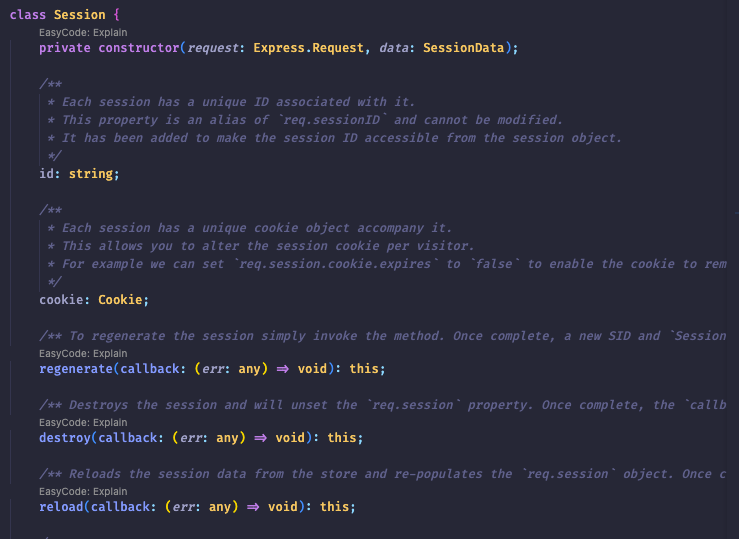
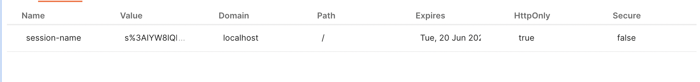

# ___[ Cookie / Session in `NestJS` ]___

[cookie / session](https://github.com/CHOIJEWON/CS/blob/main/src/WEB/cookie_session.web.md) 의 포스팅을 진행한적이 있다, 하지만 항상 auth를 구성하며 사용해본것은 JWT가 전부이다

그런데 이번 회사 프로젝트를 진행하며 cookie / session의 기반한 auth를 구성하게 되어 

___NestJS___ cookie/session 구현 방식에 대해 포스팅해보려고 한다

<br>

# ___[ How ]___ ?


## 1. 라이브러리 설치 

[NestJS](https://docs.nestjs.com/techniques/session) 공식 docs에서 사용하는 라이브러리가 따로 존재한다

Nest 프로젝트를 만들었다면 해당 라이브러리를 설치해주어 셋업하자

````
yarn add express-session

yarn add @types/express-session
````

## 2. Main.ts session init

라이브러리를 모두 설치했다면 Main.ts 파일에 session / cookie에 대한 스펙을 작성해주어야 한다

````javascript
// main.ts 

app.use(
    session({
      secret: 'session-secret', // session secret env 파일에 저장하면 된다 해당 코드는 예제이다
      name: 'session-name', // 해당 이름으로 session이 저장되게 된다 후에 이미지 첨부 예정이니 거기서 확인하자
      resave: false, // request가 일어나는 경우 session의 변화가 없어도 session을 다시 저장하는 옵션
      saveUninitialized: false, // uninitialized 상태의 session을 강제로 계속 저장 
      cookie: {
        // httpOnly, secure등은 따로 포스팅 예정 해당 설정은 주석으로 설명하기엔 너무 길다
        httpOnly: true, 
        secure: false,
        maxAge: 60 * 60 * 24 * 30, // expires time 셋팅이다 코드 기준으로 1시간
      },
    }),
  );
````

해당 셋팅 말고도 `store` 옵션도 사용중인데 제외할 경우 In memory가 default이다

나는 redis에 저장중이며 redis와의 연동은 다음 포스팅에서 다루겠다 (~~귀찮다~~)

## 3. DTO

DTO를 만들어주는 이유는 `Request`에는 userId라는 프로퍼티가 존재하지 않다 따라서 TypeScript에서 사용하는 경우에

__req.session.userId__ 로 접근하는 방법이 //@ts-ignore 를 사용하는 방법밖에는 딱히 떠오르지 않는데

좋은 방법은 아닌 것 같아서 interface를 따로 작성해서 userId를 Session에 박아주었다

추가로 userId를 session class에 바로 박아주자니 CI / CD 쪽에서 분명히 문제가 생길 것 같았다

````javascript
import { Session } from 'express-session';

export interface CustomSession extends Session {
  userId: string;
}
````

해당 express-session의 session을 까보면 이런 모양으로 생겼다




## 4. Controller

````javascript
  @Get()
  createSession(@Session() session: CustomSession) {
    session.userId = '1'; // create session.userId
  }

  @Get('test')
  getSession(@Req() req: Request, @Res() res: Response) {
    console.log(req.sessionID);
    req.sessionStore.all((err, sessions) => {
      res.send(sessions);
    });
  }

  @Post('delete')
  delSession(@Req() req: Request) {
    req.sessionStore.destroy(req.sessionID);
  }
````

이정도 코드면 뭐 session을 생성, 조회, 삭제하는데는 문제가 없어서 간추렸다, 메모리에 저장되는 session을 확인하는거고

추가적인 기능들을 확인하고 싶다면 [express-session](https://www.npmjs.com/package/express-session)에서 확인하자 예제도 잘 나와있고 함수도 잘 정리되어 있다

본인처럼 store 자체를 redis로 설정해주면 redis가 디폴트 session store가 되면서 redis의 정보를 갖고 오게 된다

일단 첫번째로 `createSession` 함수를 실행시켜 결과를 확인해보자



`Name`에 보면 우리가 main.js에서 설정해준 session-name이 오는것을 확인할수 있다

두번째로 `getSession` 함수를 실행시켜 결과를 확인해보면

````javascript
console.log(req.sessionID) // 59AMxsyhO_cV2KI3FdnuHaZY6HQZUFmi

// res.send(sessions)
{
    "59AMxsyhO_cV2KI3FdnuHaZY6HQZUFmi": {
        "cookie": {
            "originalMaxAge": 2592000,
            "expires": "2023-06-20T08:32:05.871Z",
            "secure": false,
            "httpOnly": true,
            "path": "/"
        },
        "userId": "1"
    }
}
````

sessionID와 session stroe의 존재하는 sessionID와 잘 맞아 떨어지는것을 볼 수 있다

마지막으로 session을 삭제한후에 (`delSesssion` 함수) 조회해보겠다(getSesssion 함수)

````javascript
console.log(req.sessionID) // if-pBQ90PMObE49KRd9HXTV1t06A0dgm

// res.send(sessions)
{}
````

session store의 session은 삭제되었지만 req.sessionID는 조회되는것을 확인할 수 있다 정확한 이유는 찾아보지 않았지만

직감적으로는 모든 요청에는 session을 담은 요청이 전송되기 때문에 sessionID는 항상 존재하는 것 같다

<br>

# ___[ 불편했던점 ]___

express-session 라이브러리는 대부분 함수들이 call back으로 이루어져있다 (~~오래된 라이브러리라 그런것 같다~~) 

나같은 경우는 인터셉터, 필터등을 사용해서 성공 케이스, 실패 케이스를 캐치해서 내가 원하는 형태로 뿌려주는 것을 좋아하는데 

call back 함수 안에서 `throw new HttpException` 코드를 사용해도 filter등을 거치지 않고 콜백 함수에서

지멋대로 에러를 뿜어버린다 따라서 그런 이유로 __redis__ 를 도입하게 되었다 redis는 따로 CRUD method를 갖고 있기 때문에

콜백 함수를 통하지 않아도 되어 코드도 깔끔하고 에러 핸들링도 간편했다
