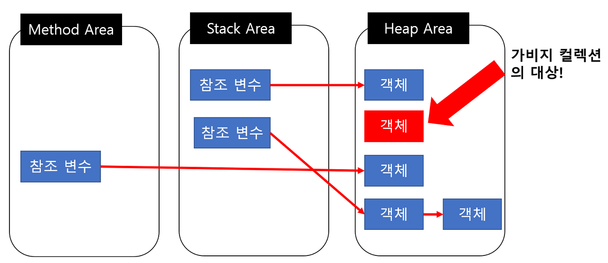

# Garbage Collection

Java에 `Garbage Collection`의 대해서 조금 더 깊게 알아보자

# _Garbage Collection?_

가비지 컬렉션은(Garbage Collection)은 줄여서 GC라고도 부르며 가비지 컬렉션은 자바의 메모리 관리 방법중의 하나이다

JVM의 Heap 영역에서 동적으로 할당했던 메모리 영역 중 필요 없게 된 메모리 영역을 주기적으로 삭제하는 프로세스이다

C / C++ 에서는 이러한 가비지 컬렉션이 없기 때문에 프로그래머가 수동으로 메모리 할당과 해제를 일일이 해줘야 하는 반면

Java는 JVM에 탑재되어 있는 GC가 메모리 관리를 대행해주기 때문에 개발자 입장에서는 메모리 관리, 메모리 누수

문제에 대해 완벽하게 관리하지 않아도 되어 오롯이 개발에만 집중할 수 있다는 장점을 갖는다

 

# _GC 단점_

1. 개발자 메모리가 언제 해제되는지 정확이 알 수 없다

2. GC가 동작하는 동안에는 다른 동작을 멈추기 때문에 오버헤드가 발생한다 (Stop-the-world 과정)

가비지 컬렉션에는 장점만 있는 것이 아니라 단점도 당연하게 존재한다 대표적으로 위의 2가지 단점이 존재하는데

이 중에서 경우에 따라 문제가 발생할 수 있는 부분은 GC가 동작하는 동안 JVM의 다른 스레드도 멈추기 때문에 오버헤드가 발생한다는 점이다

이로 인해 실시간으로 계속 동작해주어야 되는 서시브를 예를 들자면 열추적 미살일의 경우에 잠깐의 소프트웨어 일시정지로도

목표한 결과가 달라질 수 있기 때문에 GC의 사용이 적합하지 않을 수 있다

 

# _GC 대상의 객체_

객체들은 실직적으로 Heap영역에서 생성되고 Method Area이나 Stack Area등 Root Area에서는 Heap Area에 생성된 객체들의 주소만 참조하는 형식으로 구성된다

하지만 이렇게 생성된 Heap Area 객체들이 메서드가 끝나는 등의 특정 이벤트들로 인하여

Heap Area 객체의 메모리 주소를 가지고 있는 참조 변수가 삭제되는 형상이 발생하면

위의 그림에서의 빨간색 객체와 같이 Heap 영역에서 어디서든 참조하고 있지 않은 객체들이 발생하게 된다

이러한 객체들을 `Unreachable`하다고 하며 주기적으로 GC가 제거해준다

> Reachable : 객체가 참조되고 있는 상태
>
> Unreachable : 객체가 참조되고 있지 않은 상태 (GC의 대상이 됨)

 

# _GC 동작 과정_

객체가 처음 생성되고 Heap영역에 Eden에 age-bit 0으로 할당, 이 age-bit는 Minor GC에서 살아남을 때마다 1씩 증가

 

시간이 지나 Heap Area의 Eden 영역에 객체가 다 쌓이게 되면 Minor GC가 한번 일어나게 되고

참조 정도에 따라 survival0 영역으로 이동하거나 회수

 

계속해서 Eden영역에는 신규 객체들이 생성됩니다. 이렇게 또 Eden영역에 객체가 다 쌓이게 되면

Young Generation(Eden+Servivor) 영역에 있는 객체들을 비어있는 Survival인 Survival1 영역에 이동하고

살아남은 모든 객체들은 age가 1씩 증가

또 다시 Eden 영역에 신규 객체들로 가득 차게 되면 다시 한번 minro GC가 일어나고

Young Generation 영역에 있는 객체들을 비어있는 Survival인 Survival0으로 이동시킨 뒤 age를 1 증가

이 과정을 계속 반복

이 과정을 반복하다 보면 age bit가 특정 숫자 이상으로 올라가는 경우가 발생함

해당 age bit가 JVM에 설정해놓은 age bit에 도달하게 되면 오랫동알 쓰일 객체라고 판단

따라서 해당 객체를 Old Generation 영역으로 이동시킵니다 이 과정을 프로모션(Promotion)이라고 함

시간이 지나 Old영역에 할당된 메모리가 허용치를 넘기게 되면, Old 영역에 있는 모든 객체들을 검사하여

참조되지 않는 객체들을 한꺼번에 삭제하는 GC가 일어나게 된다

이렇게 Old generation 영역에 메모리를 회수하는 GC를 `Major GC`라고 함

Major GC는 시간이 오래 걸리는 작업이고, 이때 GC를 실행하는 스레드를 제외한 다른 스레드는 모두 작업을 멈추게 됨

이를 `Stop-the-World`라고 칭하며 이 작업이 너무 잦으면 프로그램 성능이 저하됨
