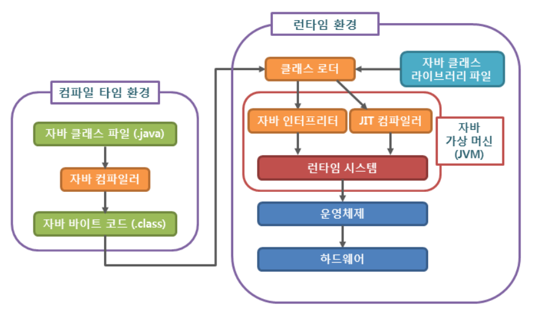

# JVM (Java Virtual Machine)

자바를 실행하기 위한 가상 머신 JVM의 대해서 알아보자

# JVM이란 ?

> Java Virtual Machine
>
> 직역하자면 자바를 실행하기 위한 가상 기계라고 할 수 있다.
>
> Java는 OS에 종속적이지 않다는 특징을 갖고 있는데 OS에 종속받지 않고 실행되기 위해선
>
> OS에서 Java를 싱핼시킬 무언가가 필요하다. 그게 바로 JVM이다
>
> 즉, OS에 정속받지 않고 CPU가 Java를 인식, 실행할 수 있게 하는 가상 컴퓨터이다

# JVM은 플랫폼에 종속적이다

Java는 컴파일된 바이트코드로 어떤 JVM에서도 동작시킬 수 있기 때문에 플랫폼에 의존적이지는 않다

하지만 반대로 자바 가상 머신 (JVM)은 플랫폼에 의존적입니다. 즉 리눅스의 JVM과 윈도우의 JVM은 서로 다르다

자바로 된 모든 프로그램은 자바 가상 머신에서만 실행될 수 있으므로, 자바 프로그램을 실행하기 위해서는

반드시 자바 가상 머신이 설치되어 있어야 한다

# 자바 프로그램의 실행 과정과 JVM

만약 사용자가 .java로 코드를 작성하고 터미널에 있는 자바 컴파일러인 javac에 컴파일 명령을 내리면

.class 파일이 만들어진다 이후 이 바이트 코드는 클래스 로더를(Class Loader) 통해 JVM Runtime Data Area

로딩되고 로딩된 .class 바이트코드를 실행한 컴퓨터에 설치된 JVM에 전달하면 가상머신이

실행할 때 이 JVM이 그때그때 기계어로 해석한다
