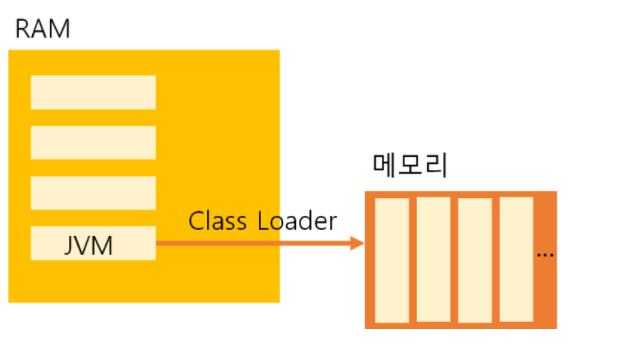
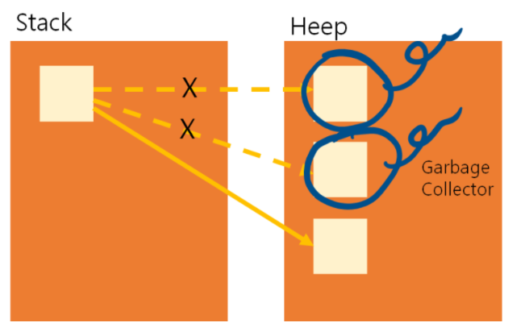

# 자바 JVM 내부 구조와 메모리 구조

자바 JVM의 내부 구조와 메모리 구조의 대하여 알아보자

# _JVM의 동작 방식_

1. 자바로 개발된 프로그램을 실행하면 JVM은 OS로부터 메모리를 할당함.

2. 자바 컴파일러(javc)가 자바 소스코드(.java)를 자바 바이트코드(.class)로 컴파일 함

3. Class Loader를 통해 JVM Runtime Data Area로 로딩

4. Runtime Data Area에 로딩 된 .class들은 Execution Engine을 통해 해석함

5. 해석된 바이트 코드는 Runtime Data Area의 각 영역에 배치되어 수행하며 이 과정에서 Execution Engine에 의해 GC의 작동과 스레드 동기화가 이루어짐

 

# _클래스 로더(Class Loader)_

 

자바는 동적으로 클래스를 읽어온다, 즉 런타임 환경에서 모든 코드가 JVM과 연결되는데

이렇게 동적으로 클래스를 로딩해주는 역할을 하는 것이 바로 Class Loader이다

자바에서 소스를 작성하기 위해 .java파일을 생성후에 컴파일하면 .class 파일이 생성되며

클래스 로더는 .class 파일을 묶어 JVM이 운영체제로부터 할당받은 메모리 영역인 Runtime Data Area로 적재한다

 

# _실행 엔진(Execution Engine)_

클래스 로더에 의해 JVM으로 로드된 .class 파일들은 Runtime Data Area의 Method Area에 배치되며

배치된 이후에 JVM은 Method Area의 바이트 코드를 실행 엔진(Execution Engine)에 제공하며

실행 엔진은 정의된 내용대로 바이트 코드를 실행시킨다 이 때, 로드된 바이트코드를 실행하는 런타임 모듈이

실행 엔진이며 실행 엔진은 바이트코드를 명령어 단위로 읽어서 실행한다

 

# _가비지 컬렉터(Garbage Collector)_

자바 가상 머신은 가비지 컬렉터(garbage collector)를 이용하여 더는 사용하지 않는 메모리를 자동으로 회수해 준다

따라서 개발자가 따로 메모리를 관리하지 않아도 되므로, 더욱 손쉽게 프로그래밍을 할 수 있도록 도와준다

`Heap` 메모리 영역에 생성(적재)된 객체들 중에 참조되지 않은 객체들을 탐색 후 제거하는 역할을 하며

해당 역할을 하는 시간은 정확히 언제인지는 알 수 없다 GC역할을 수행하는 스레드를 제외한 나머지 스레들은 일시정지 상태가 된다

 

# _런타임 데이터 영역(Runtime Data Area)_

런타임 데이터 영역은 JVM의 메모리 영역으로 자바 애플리케이션을 실행할 때 사용되는 데이터들을 적재하는 영역이다

- 모든 스레드가 공유해서 사용하는 자원 (Garbage Collector의 대상이 됨)

  - 힙 영역 (Heap Area)

  - 메서드 영억 (Method Area)

- 스레드마다 하나씩 생성되는 자원

  - 스택 영역

  - PC 레지스터 (PC Register)

  - 네이티브 메서드 스택 (Native Method Stack)

   

# _메서드 영역 (Method Area)_

클래스 멤버, 변수의 이름, 데이터 타입, 접근 제어자 정보와 같은 각종 필드 정보들과 메서드 정보,

데이터 Type정보, Constant Pool, static변수, final class등이 생성되는 영역이다

 

# _힙 영역 (Heap Area)_

1. new 키워드로 생성된 객체와 배열이 생성되는 영역

2. 주기적으로 Garbage Collector가 제거하는 영역

Heap Area는 효율적인 Garbage Collector를 위해 위와 같이 크게 3가지의 영역으로 나뉘게 됨

 

### Young Generation

 

`Young Generation` 영역은 자바 객체가 생성되자마자 저장되며, 생긴지 얼마 안 되는 객체가 저장되는 공간이다

Heap 영역에 객체가 생성되면 최초로 Eden 영역에 할당됩니다. 그리고 이 영역에 데이터가 어느정도 쌓이게 되면

참조 정되에 때라 survivor의 빈 공간으로 이동되거나 Garbage Collector에 의해서 회수된다

Young Generation(Edn + Servivor) 영역이 차게 되면 또 참조정도에 따라 Old영역으로 이동 되거나 회수된다

이렇게 Young Generation과 Tenured Generation 에서의 GC를 `Minor GC`라고 부른다

Old 영역에 할당된 메모리가 혀용치를 넘게 되면, Old 영역에 있는 모든 객체들을 검사하여

참조되지 않는 객체들을 한꺼번에 삭제하는 GC가 실행된다 시간이 오래 걸리는 작업이고 이 때 GC를 실행하는 스레드를 제외한

모든 스레드는 작업을 멈추게 된다 이를 `Stop-thw-World`라 칭한다 이렇게 Stop-thw-World가 발생하고

Old 메모리를 회수하는 GC를 Major GC라고 한다

 

# _스택 영역(Stack Area)_

지역변수, 파라미터, 리턴 값, 연산에 사용되는 임시 값 등이 생성되는 영역

 

# _PC 레지스터 (PC Register)_

Thread가 생성될 때마다 생성되는 영역으로 프로그램 카운터, 즉 현재 스레드가 실행되는 부분의 주소와 명령을 저장하고 있는 영역

 

# _네이티브 메서드 스택(Native Method Stack)_

1. 자바 이외의 언어 (C, C++, ..)로 작성된 네이티브 코드를 실행할 때 사용되는 메모리 영역으로 일반적인 C스택을 사용한다

2. 보통 C/C++ 등의 코드를 수행하기 위한 스택을 말하며(JNI) 자바 컴파일러에 의해 변환된 자바 바이트 코드를 읽고 해석하는 역할을 하는 것이 자바 인터프리터(interpreter)이다
