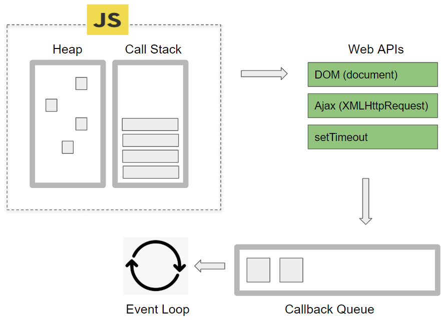
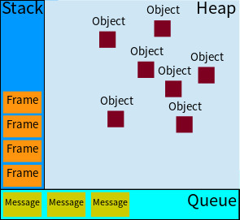
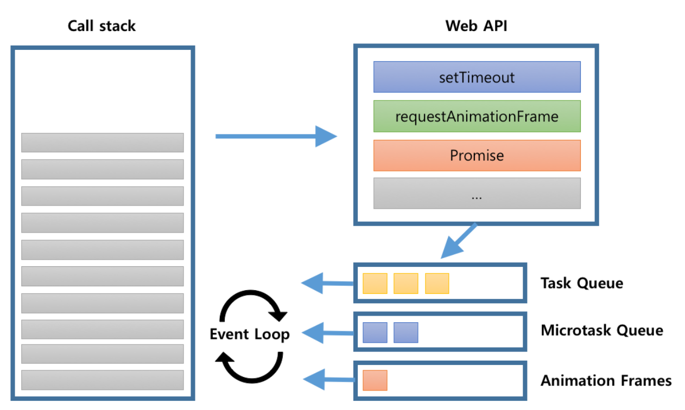

# Javascript Event Loop?

자바스크립트가 싱글 스레드인것은 다들 잘 알고 있는 사실이다 그런데 어떻게 자바스크립트는 동시성을 지원할까

그 해답은 `EventLoop`라는것에 있다 Javascript 동작 과정의 핵심 이벤트루프에 대하여 알아보자

# | _단일 스레드_ |

자바스키릅트는 `단일 스레드`이다 프로세스에 대해여 공부했다면 스레드의 역할이 무엇인지 대강 짐작하고 있을 것 이다

단일 스레드라는 말은 <u>**_동시에 하나의 작업만 처리할수 있다_**</u> 하지만 자바스크립트로 개발해 본 경험이 있다면 느끼겠지만

동시에 작업이 처리되는 것을 알 수 있다 어떻게 단일 스레드인 자바스크립트에서 해당 작업이 가능할까

주의깊게 볼 것은 Call Stack인데 해당 영역은 코드가 실행되는 경우에 FILO(First In Last Out)의 순서로 쌓이게 된다

싱글 스레드의 특성 답게 한 번에 여러개의 코드를 실행시키는것이 아닌 코드를 하나씩 실행시키는 동작을 하게 되는 것이다

여기서 주의 깊게 봐야 되는 것은 `단일 스레드`라는 말은 자바스크립트 엔진이 단일 호출 스택을 사용한다라는 사실이다

반면에 자바스크립트가 구동되는 환경(브라우저, Node.js...)등에서 여러 개의 스레드가 사용된다

이러한 구동 환경이 단일 호출 스택을 사용하는 자바스크립트 엔진과 상호연동 하게 되는데 그 장치가 바로 `Event Loop`이다

**_자바스크립트는 이벤트 루프를 이용해서 비동기 방식으로 동시성을 지원한다_**

<center>



</center>

<br>

# | _Event Loop_ |

<center>




</center>

# | _Heap_ |

Heap 영역은 코드가 실행되며 동적으로 메모리를 할당한다 해당 영역에는 참조 타입(객체 등) 데이터가 저장된다

<br>

# | _Call stack_ |

코드가 실행될 때 쌓이는 공간이다 단 하나의 호출 스택을 사용하기 때문에 자바스크립트의 함수가 실행되는 방식을 `Run To Completion`

이라고 부르며 하나의 함수가 실행되면 이 함수가 끝날 때까지는 다른 작업들은 끼어들지 못한다

요청이 들어올 때마다 순차적으로 호출 스택을 담아 처리한다 함수의 호출들은 "프레임" 스택을 형성한다고 말한다

함수가 실행되면 Call Stack에 새로운 프레임이 생기고 처리가 끝나면 없어지는 원리이다

아래 코드의 동작 과정을 알아보며 조금 더 이해를 돕겠다

```javascript
function foo(a) {
  const b = 2;
  return a + b;
}

function bar(x) {
  const y = 1;
  return foo(x + y);
}

const bar = bar(1);
```

1. bar()가 호출될 때, 첫 번째 프레임이 생성되어 콜스택에 쌓이게 됨

2. bar()안에 있는 foo()가 호출될 때, 콜 스택에 첫 번째 프레임 위로 두 번째 프레임이 생성되어 쌓이게 됨

3. foo()가 반환되면 두 번째 프레임은 없어짐 (현재 Call Stack에는 bar 프레임만이 남아있음)

4. bar()가 반환되면 첫 번째 프레임이 없어져 콜스택은 현재 비어있음

<br>

# | _Web APIs_ |

Web APIs는 자바스크립트 엔진과는 다른 엔진이며, 이는 브라우저에서 제공하는 API로 비동기인 setTimeout, Promise등이 있다

Call Stack에서 실행된 비동기 함수들은 모두 Web API를 호출하며 Web API는 콜백 함수를 Callback Queue에 넣게 된다

```javascript
constol.log(1);
setTimeout(() => {
  console.log(2);
}, 0);
console.log(3);

// console
1;
3;
2;
```

1. console.log(1)이 콜스택에 들어가 실행되게 됨(그저 콘솔에 노출하기 때문에 실행과 동시에 스택에서 사라짐)

2. setTimeout을 만나 콜스택은 이를 Web API로 이동함

3. console.log(3)이 콜스택에 들어가 실행됨

4. console.log(2)이 콜스택에 들어가 실행됨

해당 동작의 원리를 알아보자면 Web API에 존재하는 setTimeout은 0ms 즉 0초 후에 바로 스택에서 콘솔을 뱉고 사라질 것 같지만

setTimeout과 같은 Web API가 필요한 경우에는 call stack에서 Web API의 영역으로 해당 함수를 넘기게 되고

그 이후에 바로 밑에 있는 console.log(3)이 콜스택에 동작과 함께 사라지며 Web API에서 동작이 완료된 함수는

Callback Queue로 빠져 call stack이 완전히 비워진 후에 해당 큐를 스택에 올려 동작을 마무리한다

<br>

# | _Callback Queue_ |

<center>



</center>

앞서 Web API에서 설명했듯 비동기적으로 실행되는 콜백 함수가 보관되는 곳이다 콜 스택에 가기 위한 웨이팅 룸의 가까운 개념이며

해당 콜백 함수들은 콜스택이 완전히 비어져 있을 때 먼저 대기열에 들어온 순서대로 수행된다

하지만 주의해야 할 점이 있는데 단순히 모든 비동기 코드가 이곳에 쌓이는 것은 아니다

Callback Queue에는 세 가지 종류가 존재한다

1. Task Queue - setTimeout, setInterval과 같은 코드

2. Microtask Queue - Promise, Callback, Async Callback과 같은 코드

3. Animation Frames - requestAnimationFrame과 같은 코드

실행 순서는 다음과 같다 "Microtask Queue => Animation Frame => Task Queue"

```javascript
console.log('Start!')

setTimeout(() => {
    console.log('TimeOut')
}, 0)

Promise.resolve('Promise').then(res => console.log(res))

console.log('End!')


// console

1. Start!
2. End!
3. Promise
4. TimeOut
```

console.log('Start!')는 첫번째로 스택에 쌓이며 바로 실행되며 스택에서 제거되며 스택이 비워진다

setTimeout은 Web API로 이동되게 되며 Task Queue에서 대기하게 된다

Promise같은 경우 Web API로 이동하게 되며 Microtask Queue에 대기하게 된다

End의 경우 스택에서 바로 실행되며 동시에 스택에서 제거되며 스택이 비워진다

이후 실행 순서에 따라 Promise가 먼저 반환되며 스택에서 제거되며 스택이 비워진다

이후 TimeOut이 비워진 스택에 올라가 실행되며 스택에서 제거되며 스택이 완전히 비워진다

<br>

# | _그래서 Event Loop ?_ |

그렇다면 도대체 Event Loop가 하는 일이 무엇일까 ?

Call Stack과 Callback Queue 사이에서 스택이 모두 비어져있는지 항상 감시하면

비어졌다면 콜백큐에서 완료된 작업들을 콜스택에 올려놓는 작업을 진행한다
