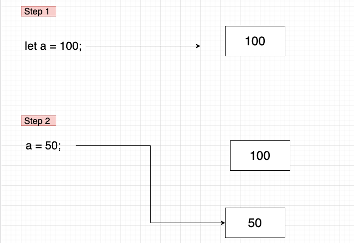

# [ JavaScript ] 원시타입과 참조타입

면접 질문에 들어본 자바스크립트의 원시타입과, 참조타입이 무엇인지 알아보고 해당 타입들의 고유한 특징 또한 알아보자

# | _JavaScript 원시타입_ |

자바 스크립트의 변수에 타입에는 크게 `Primitive Type(원시타입)`과 `Reference Type(참조타입)`으로 나뉘어져 있다

원시타입의 변수들은 데이터 복사가 일어날 때 메모리 공간을 새로 확보하여 독립적인 값을 저장한다

참조 타입은 메모리에 직접 접근이 아닌 메모리의 위치(주소)에 대한 간접적인 참조를 통해 메모리에 접근한다

<br>

# | _원시 타입은 불변성(immutable)을 갖고있다_ |

> JavaScript 원시타입
>
> 자바스크립트 원시타입으로는 string, number, bigint, boolean, undefined, ES6부터 추가된 symbol이 있다

원시타입은 변수에 할당될 때 메모리의 고정 크기로 원시 값을 저장하고 해당 저장된 값을 변수가 직접적으로 가르키는 형태를 띈다

또한 값이 절대 변하지 않는 불변성읠 갖고 있기 때문에 재할당시 기존 값이 변하는 것 처럼 보일지 몰라도

사실 새로운 메모리에 재할당한 값이 저장되고 변수가 가리키는 메모리가 달라졌을 뿐이다

```javascript
let a = 100;

a = 50;
```

위의 예제에서 보면 a란 변수에 100이라는 값을 할당하고 2번째 라인에서 50으로 재할당을 해준 예시이다

첫 라인이 실행되면 메모리에 Number타입의 100이란 값이 생성되고 a는 메모리에 생성된 100의 메모리 주소를 가리킨다

그 후 두번째 라인이 실행되면 이전에 메모리에 생성된 100이란 값이 50으로 수정되는것이 아닌, 새로운 Number타입의

50이란 값을 새로운 메모리에 생성하고 a가 가리키던 메모리가 바뀌는 것이다



즉 메모리에는 100과 50이란 값이 모두 존재하고 있으며, 앞에서 말했듯이 원시타입은 불변성을 갖고 있기 때문에

기존 메모리에 생성된 값들은 그 자체가 변경될 수 없다. 그저 식별자와 연결되어 있는 메모리가 바뀌었기 때문에

우리가 인식하기에는 재할당 된 것 처럼 보일 뿐이다

<br>

# | _원시타입 복사_ |

```javascript
let a = 100;
let b = a;
a = 50;

console.log(b); // 100
```


새로운 변수 b에 a를 할당 하게되면 변수 b의 공간에는 a의 값을 통째로 복사하여 변수의 메모리에 담게 되는데

그렇기에 변수 a가 50으로 재할당 되더라도 b는 전혀 영향을 받지 않는다

<br>

# | _Reference Type(참조타입)_ |

**원시타입을 제원한 나머지는 참조 타입이다** 배열과 객체, 함수가 대표적이며 원시타입과 가장 큰 차이점은

변수의 크기가 동적으로 할당된다는 것이다 이러한 특징 때문에 Object의 데이터 자체는 Heap 메모리 공간에 동적으로 할당되며

변수에 할당 시 데이터에 대한 주소가 저장되기 때문에 자바스크립트 엔진이 변수가 갖고 있는 메모리 주소를 이요해서 변수의 값에 접근하는 것이다


```Javascript

let arr = []
let copyArr = arr

arr.psuh("Hello, World!")

console.log("Hello, World") // [1]
```
