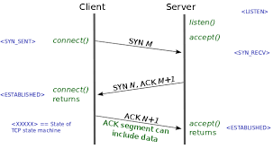
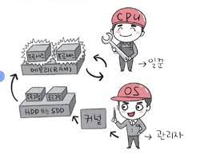
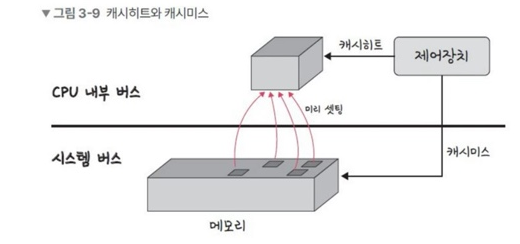
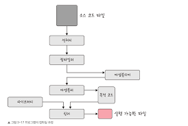
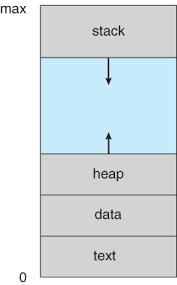

# 내가 선택한 중요 정보

사실 CS영역에서 전공자도 아닌 내가 이것은 중요하다, 이것은 덜 중요하다를 따질 만한 레벨은 아니라고 생각한다 <br>
하지만 내가 현업에 있으며, 코딩 공부를 진행하며 많이 들어봤던 개념들을 많이 뽑아서 우선적으로 정리했다 <br>
책의 모든 내용을 깊이 공부해야 되는 것은 맞지만 일단 면접이 며칠 안 남았는데 다 볼 시간은 없고 <br>
급하게 정리하는 나의 컨닝노트 같은 것이다 ㅋㅋ..

## 1. SOLID

### S(SRP, Single Responsibility Principle) - 단일 책임 원칙

`단일 책임 원칙` 모든 클래스는 각각 하나의 책임만을 가져야 하는 원칙<br>
에를 들어 A라는 로직이 존재한다면 어떠한 클래스는 A에 관한 클래스여야하고 <br>
이를 수정한다고 했을 때도 A와 관련된 수정이어야 한다

### O (OCP, Open Closed Principle) - 개방/폐쇄 원칙

`개방폐쇄 원칙`은 유지 보수 사항이 생긴다면 코드를 쉽게 확장할 수 있도록 하고<br>
수정할 때는 닫혀 있어야 하는 원칙이다. 즉, 기존의 코드는 잘변경하지 않으며<br>
확장은 쉽게 이행 할 수 있어야 한다

### L (LSP, Liskov Substitution Principle) - 리스코프 치환 원칙

`리스코프 치환 원칙`은 프로그램 객체는 프로그램의 정확성을 깨뜨리지 않으며<br>
하위 타입의 인스턴스를 바꿀 수 있어야 하는 것을 의미<br>
클래스는 상속이 되기 마련이고 부모, 자식이라는 계층 관계가 만들어짐 <br>
이때 부모 객체에 자식 객체를 넣어도 시스템이 문제없이 돌아가게 만드는 것을 말한다<br>

### I (ISP, Interface Segregation Princile) - 인터페이스 분리 원칙

`인터페이스 분리 원칙`은 하나의 일반적인 인터페이스보다<br>
구체적인 여러 개의 인터페이스를 만들어야 하는 원칙을 말합니다

### D (DIP, Dependency Inversion Principle) - 의존 역전 원칙

`의존 역전 원칙`은 자신보다 변하기 쉬운 것에 의존하던 것을 추상화된 인터페이스나 <br>
상위 클래스를 두어 변하기 쉬운 것의 변화에 영향받지 않게 하는 원칙을 말한다 <br>
가령 예를 들어, 타이어를 갈아끼울 수 있는 휠을 만들어 놓은 후<br>
다양한 타이어를 교체할수 있어야 합니다 즉, 상위 계층은 하위 계층의 변화에 자유로워야함

## 2. HTTP

### `HTTP 1.0`

서버로부터 파일을 가져올 때마다 TCP의 `3-웨이 핸드셰이크`를 반복적으로 열어줘야 하기 때문에<br>
RTT가 증가하는 단점이 있습니다



> ### 💡3way-handshake
>
> 위 그림처럼 클라이언트와 서버가 통신할 때 다음과 같은 세 단계의 과정을 거친다
>
> 1. SYN 단계: 클라이언트는 서버에 클라이언트의 ISN을 담아 SYN을 보냅니다
> 2. SYN + ACK 단계: 서버는 클라이언트의 SYN을 수신하고 서버의 ISN을 보내며 승인번호로 클라이언트의 ISN +1을 보냅니다
> 3. ACK 단계 : 클라이언트는 서버의 ISN + 1한 값인 승인번호를 담아 ACK를 서버에 보냅니다

> ### 💡RTT
>
> 패킷이 목적지에 도달하고 나서 다시 출발지로 돌아오기까지 걸리는 시간

### RTT의 증가 해결 방법

매번 연결할 때마다 RTT가 증가하니 서버에 부담이 많이 가고 사용자의 응답 시간이 길어짐<br>
이를 해결하기 위해 이미지 스플리팅, 코드 압축, 이미지 Base64 인코딩을 사용하곤 함

```
1. 이미지 스플리팅

많은 이미지를 다운로드받게 되면 과부하가 걸리기 때문에 많은 이미지가 합쳐 있는 하나의
이미지를 다운로드 받고, 이를 기반으로 background-image의 position을 이용
이미지를 표기하는 방식

2. 코드 압축

코드 압축은 코드를 압축해서 개행 문자, 빈칸을 없애서 코드의 크기를 최소하시키는 것

3. 이미지 base64 인코딩

이미지 파일을 64진법으로 이루어진 문자열로 인코딩하는 방법
이 방법을 사용하려면 서버와의 연결을 열고 이미지에 대해 서버에 HTTP 요청을 할 필요가 없다는 장점이 있음
하지만 base64 문자열로 변환할 경우 37% 정도 이미지가 커지는 단점이 있다
```

## `HTTP 1.1`


### Waht is HTTP/1.0

HTTP/1.0에서 발전한 것이 바로 HTTP/1.1이다<br>
매번 TCP연결을 하는 것이 아니라 한 번 TCP 초기화를 한 이후에 `keep-alive`라는 옵션으로<br>
여러 개의 파일을 송수신 할 수 있게 바뀌었다<br>
참고로 HTTP/1.0에도 keep-alive가 존재하지만 표준화가 되어 있지 않았고 1.1부터 기본 옵션이다

### HTTP/1.0의 한계

1. `HOL Blocking`<br>
   문서 안에 포함된 다수의 리소스(이미지, css, script) 등을 처리하려면 요청할 리소스 개수에 비례해서 대기 시간이 길어지는 단점이 있다

2. `무거운 헤더 구조` <br>
   HTTP/1.1의 헤더에는 쿠키 등 많은 메타데이터가 들어 있고 압축이 되지 않아 무거웠다

## `HTTP/2`

HTTP/2는 SPDY 프로토콜에서 파생된 HTTP/1.x보다 지연 시간을 줄이고 응답 시간을 더 빠르게 할 수 있으며<br>
멀티플랙싱, 헤더 압축, 서버 푸시, 요청의 우선순위 처리를 지원하는 프로토콜이다

```
1. 멀티 플렉싱

멀티플렉싱이란 여러 개의 스트림을 사용하여 송수신하다는 것입니다,
이를 통해 특정 스트림의 패킷이 손실되었다고 하더라도 해당 스트림에만 영향을 미치고
나머지 스트림은 멀쩡하게 동작할 수 있습니다

2. 헤더 압축

이를 통해 HTTP/2에서는 헤더 압축을 써서 해결하는데,
허프만 코딩 압축 알고리즘을 사용하는 HPACK 압축 형식을 가집니다

3. 서버 푸시

HTTP/1.1에서는 클라이언트가 서버에 요청을 해야 파일을 다운로드받을 수 있었다면
HTTP/2는 클라이언트 요청 없이 서버가 바로 리소스를 푸시할 수 있습니다.
```

> ### 💡허프만 코딩
>
> 허프만 코딩은 문자열을 문자 단위로 쪼개 빈도수를 세어 빈도가 높은 정보는
> 적은 비트 수를 사용하여 표현하고, 빈도가 낮은 정보는 비트 수를 많이 사용하여 표현해서
> 전체 데이터의 표현에 필요한 비트양을 줄이는 원리입니다

## `HTTPS`

HTTP/2는 HTTPS위에서 동작합니다. HTTPS는 애플리케이션 계층과 전송 게층 사이에<br>
신뢰 계층인 `SSL/TLS` 계층을 넣은 신뢰할 수 있는 HTTP 요청을 말합니다<br>
이를 통해 `통신을 암호화`'합니다

### SSL/TLS

SSL TLS은 전송 계층에서 보안을 제공하는 프로토콜.<br>
클라이언트와 서버가 통신할 때 SSL/TLS를 통해 제3자가 메시지를 도청하거나 변조하지 못하도록 함

## 2. 운영체제

```
운영체제와, 컴퓨터

하드웨어와 소프트웨어(유저 프로그램)을 관리하는 일꾼인 운영체제  CPU, 메모리 등으로 이루어진 컴퓨터
```

### `운영체제와 역할`

1. `CPU 스케줄링과 프로세스 관리 `: CPU 소유권을 어떤 프로세스에 할당할지, 프로세스의 생성과 삭제, 자원 할당 및 반환을 관리합니다
2. `메모리 관리` : 한정된 메모리를 어떤 프로세스에 얼만큼 할당해야 하는지 관리합니다.
3. `디스크 파일 관리`: 디스크 파일을 어떠한 방법으로 보관할지 관리합니다
4. `I/O 디바이스 관리`: I/O 디바이스들인 마우스, 키보드 컴퓨터 간에 데이터를 주고받는 것을 관리합니다.

<br>
<center>


</center>

```
유저 프로그램에 맨 위에 있고 그다음으로 GUI, 시스템콜, 커널, 드라이버가 있으며 가장 밑에 하드웨어가 있는 구조
여기서 GUI/CUI, 시스템콜, 커널, 드라이버 부분이 바로 운영체제이다
```

> 💡 `GUI` <br>
>
> 사용자가 전자장치와 상호 작용할 수 있도록 하는 사용자 인터페이스의 한 형태, 단순 명려어 창이 아닌 아이콘을 <br>
> 마우스로 클릭하는 단순한 동작으로 컴퓨터와 상호 작용할 수 있도록 해준다.
>
> 💡 `드라이버` <br>
>
> 하드웨어를 제어하기 위한 소트프웨어
>
> 💡 `CUI` <br>
>
> 그래픽이 아닌 명령어로 처리하는 인터페이스

<br>

### 시스템콜

<center>


출처: Operating System Concepts 10th - SILBERSCHARTZ

</center>

`시스템콜이란` 운영체제가 커널에 접근하기 위한 인터페이스이며 유저 프로그램이 운영체제의 서비스를 받기 위해 커널 함수를 호출할 때 사용 <br>
유저 프로그램이 `I/O요청`으로 트랩(trap)을 발동하면 올바른 I/O 요청인지 확인한 후 유저 모드가 시스템콜을 통해 커널 모드로 변환되어 실행됩니다<br>
예를 들어 I/O 요청인 fs.readFile()이라는 파일 시스템의 파일을 읽는 함수가 발동했다고 가정하자.

> 💡 I/O 요청
>
> 입출력 함수, 데이터베이스, 네트워크, 파일 접근 등에 관한 일

프로세스나 `스레드에서 운영체제`로 어떠한 요청을 할 때 시스템콜이라는 인터페이스와 커널을 거쳐 운영체제에 전달됨<br>
이 시스템콜은 하나의 추상화 계층이다 그렇기 때문에 이를 통해 네트워크 통신이나 데이터베이스와 같은<br>
낮은 단계의 영역 처리에 대한 부분을 많이 신경 쓰지 않고 프로그램을 구현할 수 있는 장점이 있다

> 💡 `프로세스` <br>
>
> 컴퓨터에서 실행되고 있는 프로그램을 말하며 CPU 스케줄링의 대상이 되는 작업(task)와 거의 같은 의미로 사용됨
>
> 💡 `스레드` <br>
>
> 포르세스 내 작업의 흐름을 지칭함

### modebit

위 사진과 같이 시스템콜이 작동하는 경우 modebit을 참고해서 `유저 모드`와 `커널 모드`를 구분합니다 <br>
modebit은 1 또는 0의 값을 가지는 플래그 변수인데 카메라, 키보드 등 I/O 디바이스는 운영체제를 통해서만 동작해야 함<br>
예를 들어 카메라를 켜는 프로그램이 있다고 가정하면<br>
만약 유저모드를 기반으로 카메라가 켜진다면, 사용자가 의도하지 않았는데 공격자가 카메라를 갑자기 켤 수 있는 등 공격 당하기 쉬움<br>
물론 `커널` 모드를 거쳐 운영체제를 통해 동작한다고 해서 100% 공격이 막아지진 않지만<br>
운영체제를 통해 작동하게 해야 막기가 쉬움 이를 위한 장치가 바로 `modebit`이다

> 💡 `유저모드` <br>
>
> 유저가 접근할 수 있는 영역을 제한적으로 두며 컴퓨터 자원에 함부로 침범하지 못하는 모드
>
> 💡 `커널 모드` <br>
>
> 모든 컴퓨터 자원에 접근할 수 있는 모드
>
> 💡 `커널` <br>
>
> 운영체제의 핵심 부분이자 시스템콜 인터페이스를 제공하며 보안, 메모리, 프로세스, 파일 시스템 I/O 디바이스 <br>
> I/O 요청 관리 등 운영체제의 중추적인 역할은 한다

## 컴퓨터의 요소

컴퓨터는 CPU, DMA 컨트롤러, 메모리, 타이머, 디바이스 컨트롤러 등으로 이루어져 있다

<center>



CPU 이미지 <br>
출처 : 면접을 위한 CS전공지식 노트

</center>

### 1. CPU

CPU(Central Processing Unit)는 산술논리연산장치, 제어장치, 레지스터로 구성되어 있는 컴퓨터 장치를 말한다<br>
인터럽트에 의해 단순히 메모리에 존재하는 명령어를 해석해서 실행하는 일꾼이다<br>
위의 그림처럼 관리자 역할을 하는 운영제체의 커널이 프로그램을 메모리에 올려 프로세스로 만들면 일꾼인 CPU가 이를 처리함

### 2. 제어장치

제어장치(CU, Contorl Unit)는 프로세스 조작을 지시하는 CPU의 한 부품이다 <br>
입출력장치 간 통신을 제어하고 명령어들을 읽고 해석하며 데이터 처리를 위한 순서를 결정한다

### 3. 레지스터

레지스터는 CPU 안에 있는 매우 빠른 임시기억장치이다 <br>
CPU와 직접 연결되어 있으므로 연산 속도가 메모리보다 수십 배에서 수백 배까지 빠르다. <br>
CPU는 자체적으로 데이터를 저장할 방법이 없기 때문에 레지스터를 거쳐 데이터를 전달한다.

### 4. 산술논리연산장치

산술논리연산장치(ALU, Arithmetic Logic Unit)는 덧셈, 뺄셈 같은 두 숫자의 산술 연산과 배타적 논리합 논리곱 같은 연산을 계산하는 디지털 회로이다


> 💡 CPU 연산 처리
>
> CPU에서 제어장치, 레지스터, 산술논리연산장치를 통해 연산하는 예는 다음과 같다
>
> 1. 제어장치가 메모리에 계산할 값을 로드함. 또한, 레지서터에도 로드함
> 2. 제어장치가 레지스터에 있는 값을 계산하라고 산술논리연산장치에 명령함
> 3. 제어장치가 계산된 값을 다시 '레지스터에서 메모리로' 계산한 값을 저장함

### 5. 메모리

메모리는 전자회로에서 데이터나 상태, 명령어 등을 기록하는 장치를 말한다, <br>
보통 RAM(Random Access Memory)을 일컬어 메모리라고도 한다 <br>
CPU는 계산을 담당하고, 메모리는 기억을 담당한다<br>
공장에 비유하자면 CPU는 일꾼, 메모리는 작업장이며, 작업장의 크기가 곧 메모리의 크기이다 <br>
작업장이 클수록 창고에서 많은 물건을 많이 할당할수 있고 많은 일을 할 수 있듯이 <br>
메모리가 크면 클수록 많은 일을 동시에 처리할 수 있다

### 5-1. 메모리 계층

<center>

<br>
출처 : http://ko.gnscomponent.com/info/cpu-design-principle-and-manufacturing-process-36361338.html

</center>

- 레지스터: CPU안에 있는 작은 메모리, 휘발성, 속도 가장 빠름, 기억 용량이 가장 적음
- 캐시: L1, L2 캐시를 지칭함. 휘발성, 속도 빠름, 기억 용량이 적다 참고로 L3도 존재함
- 주기억장치: RAM을 가리킵니다. 휘발성, 속도 보통, 기억 용량이 보통임
- 보조기억장치: HDD / SSD를 일컬으며 비화발성, 속도 낮음, 기억 용량이 많음
  <br>

램은 하드디스크로부터 일정량 데이터를 복상해 임시 저장, 이를 필요 시마다 CPU에 빠르게 전달하는 역할을 함<br>
계층이 위로 올라갈수록 가격은 비싸지는데 용량은 작아지고 속도는 빨라지는 특징이 있다 <br>
이러한 계층이 있는 이유는 경제성과 캐시 때문이다 <br>
예를 들어 16GB RAM은 8만 원이면 산다고 가정할때 16GB SSD는 훨씬 더 싼 가격에 구매가 가능하다 <br>
이러한 경재성 때문에 계층을 두어 관리함 <br>
이러한 계층 구조는 일상생활에서 경험이 가능한데 게임을 실행하다 '로딩 중'이라는 메시지는<br>
하드디스크 또는 인터넷에서 데이터를 읽어 RAM으로 전송하는 과정이 끝나지 않은 것임<br>

### 5-2. 캐시

캐시(cache)는 데이터를 미리 복사해 놓은 임시 저장소이자 빠른 장치와 느린 장치의 속도 차이에 따른 병목 현상을 줄이기 위한 메모리이다<br>
실제로 메모리와 CPU 사이의 속도 차이가 너무 크기 때문에 그 중간에 레지스터 계층을 둬서 속도 차이를 해결한다<br>
이렇게 속도 차이를 해결하기 위해 계층과 게층 사이에 있는 계층을 캐싱 계층이라고 한다<br>
예를 들어 메모리와 보조기억장치 사이에 있는 주기억장치를 보조기억장치의 캐싱 계층이라고 할 수 있다

### 5-2-1. 캐시히트와 캐시미스

<center>



</center>

캐시에서 원하는 데이터를 찾았다면 `캐시히트`라고 하며. <br>
해당 데이터가 캐시에 없다면 주메모리로 가서 데이터를 찾아오는 것을 `캐시미스`라고 한다.
<br>
<br>
위의 그림처럼 캐시히트를 하게 되면 해당 데이터를 제어장치를 거쳐 가져오게 된다<br>
캐시히트의 경우 위치도 가깝고 CPU 내부 버스를 기반으로 작동하기 때문에 빠르다<br>
반면에 캐시미스가 발생되면 메모리에서 가져오게 되는데, 이는 시스템 버스를 기반으로 작동하여 속도가 느리다

### 5-2-2. 캐시매핑

`캐시매핑`이란 캐시가 히트되기 위해 매핑하는 방법을 말하며 CPU의 레지스터와 주 메모리(RAM)간에 데이터를 주고받을 때 기반으로 설명<br>
레지스터는 주 메모리에 비하면 굉장히 작고 주 메모리는 굉장히 크기 때문에 작은 레지스터가 캐시 계층으로써 역할을 잘 해주려면<br>
이 매핑을 어떻게 하느냐가 중요하다

| 이름                                    | 설명                                                                                                                                                                                                                                         |
| --------------------------------------- | -------------------------------------------------------------------------------------------------------------------------------------------------------------------------------------------------------------------------------------------- |
| 직접 매핑(directed mapping)             | 메모리가 1~100이 있고 캐시가 1~10이 있다면 1:1~10, 2:1 ~ 20 이런 식으로 매핑하는 것을 말합니다. 처리가 빠르지만 충돌 발생이 잦다                                                                                                             |
| 연관 매핑 (associative mapping)         | 순서를 일치시키지 않고 관련 있는 캐시와 메모리를 매핑한다 충돌이 적지만 모든 블록을 탐색해야 해 속도가 느리다                                                                                                                                |
| 집합 연관 매핑(set associative mapping) | 직접 매핑, 연관 매핑을 합쳐 놓은 것 순서는 일치시키지만 집합을 둬 저장하며 블록화되어 있기 때문에 검색이 좀 더 효율적이다. 예를 들어 메모리가 1~100이 있고 캐시가 1~10이 있다면 캐시는 1~5에는 1~50의 데이터를 무작위로 저장시키는 것을 말함 |

### 6. 타이머

타이머(timer)는 몇 초 안에는 작업이 끝나야 한다는 것을 정하고 특정 프로그램에 시간을 제한하는 역할을 한다<br>
시간이 많이 걸리는 프로그램이 작동할 때 제한을 걸기 위해 존재한다.

### 7. 디바이스 컨트롤러

디바이스 컨트롤러(device controller)는 컴퓨터와 연결되어 있는 I/O 디바이스들의 작은 CPU를 말한다

## 프로세스와 스레드

프로세스란 컴퓨터에서 실행되고 있는 프로그램을 말하며 CPU 스케줄링의 대상이 되는 작업(task)와 거의 같은 의미로 사용됨<br>
스레드는 포르세스 내 작업의 흐름을 지칭함
프로그램이 메모리에 올라가면 프로세스가 되는 인스턴스화가 일어나고, 이후 운영체제의 CPU 스케줄러에 따라 CPU가 프로세스를 실행함

### 1. 프로세스와 컴파일 과정

프로세스는 프로그램으로부터 인스턴스화된 것을 말한다 <br>
예를 들어 프로그램은 구글 크롬 프로그램(chrome.exe)과 같은 실행 파일이며, 이를 두 번 클릭하면 구글 크롬 `프로세스`가 시작됨 <br>
`프로그램`은 컴파일러가 컴파일 과정을 거쳐 컴퓨터가 이해할 수 있는 기계어로 번역되어 실행될 수 있는 파일이 되는 것을 의미하며<br>
`컴파일 과정`이란 다음과 같습니다. 참고로 여기서 말하는 프로그램이란 C언어 기반의 프로그램이며 이는 별도의 컴파일 과정없이 <br>
한 번에 한 줄씩 읽어들여서 실행하는 프로그램인 인프리터 언어(파이썬 등)으로 된 프로그램과는 다르다
<br>
<br>

<center>



</center>

### 전처리

소스 코드의 주선을 제거하고 #include등 헤더 파일을 병합하여 매크로를 치환한다

### 컴파일러

오류 처리, 코드 최적화 작업을 하며 어셈블리어로 변환함

### 어셈블러

어셈블리어는 목적 코드(object code)로 변환된다. 이때 확장자는 운영체제마다 다른데 <br>
리눅스에서는 .o이다 예를 들어 가영.c라는 파일을 만들었을 때 가영.o라는 파일이 만들어지게 된다

### 링커

프로그램 내에 있는 라이브러리 함수 또는 다른 파일들과 목적 코드를 결합하여 실행 파일을 만든다<br>
실행 파일 확장자는 .exe 또는 .out이라는 확장자를 갖는다

### 2. 프로세스의 상태

<center>


출처 : https://itwiki.kr/w/%ED%94%84%EB%A1%9C%EC%84%B8%EC%8A%A4_%EC%83%81%ED%83%9C

</center>

### 2-1. 생성 상태

생성 상태(create)는 프로세스가 생성된 상태를 의미하며 fork() exec() 함수들을 통해 생성합니다. 이때 `PCB`가 할당됩니다

> 💡 PCB ?
>
> 운영체제에서 프로세스에 대한 메타데이터를 저장한 `데이터`를 말한다<br>
> 프로세스 제어 블록이라고도 한다 프로세스가 생성되면 운영체제는 해당 PCB를 실행한다<br>

### 2-1-1. fork()

fork()는 부모 프로세스의 주소 공간을 그대로 복사, 새로운 자식 프로세스를 생성하는 함수이다 <br>
주소 공간만 복사할 뿐이지 부모 프로세스의 비동기 작업 등을 상속하지 않는다

### 2-1-2. exec()

exec()은 새롭게 프로세스를 생성하는 함수이다

### 3. 대기 상태

대시 상태(ready, wait)는 메모리 공간이 충분하면 메모리를 할당받고 아니면 아닌 상태로 대기하고 있으며<br>
CPU 스케줄러로부터 CPU 소유권이 넘어오기를 기다리는 상태이다

### 4 대기 중단 상태 (해당 그림에는 존재하지 않음)

대기 중단 상태(ready suspended)는 메모리 부족으로 일시 중단된 상태이다

### 5. 실행 상태

실행 상태(running)는 CPU 소유권과 메모리를 할당받고 인스트럭션을 수행 중인 상태를 의미합니다<br>
이를 CPU burst가 일어났다고도 표현함

### 6. 중단 상태 ( 해당 그림에는 존재하지 않음 )

중단 상태(blocked)는 어떤 이벤트가 발생한 이후 기다리며 프로세스가 차단된 상태이다 <br>
I/O 디바이스에 의한 인터럽트로 이런 현상이 많이 발생한다<br>
예를 들어 프린트 인쇄 버튼을 눌렀을 때 프로세스가 잠깐 멈춘 듯할 때가 있다 바로 그 상태이다.

### 7. 일시 중단 상태

일시 중단 상태 (blocked suspended)는 대기 중단과 유사하다.<br>
중단된 상태에서 프로세스가 실행되려고 했지만 메모리 부족으로 일시 중단된 상태이다

### 8. 종료 상태

종료 상태(terminated)는 메모리와 CPU 소유권을 모두 놓고 가는 상태를 말한다.<br>
종료는 자연스럽게 종료되는 것도 있지만 부모 프로세스가 자식 프로세스를 강제시키는 비자발적 종료(abort)로 종료되는 것도 있다<br>
자식 프로세스에 할당된 자원의 한계치를 넘어서거나 부모 프로세스가 종료되거나 사용자가 kill등 여러 명어로 프로세스를 종료할 때 발생한다

### 3. 프로세스와 메모리 구조

운영체제는 포로세스에 적절한 메모리를 할당하는데 다음 구조를 기반으로 할당한다

<center>

<br>
출처 : https://velog.io/@cchloe2311/%EC%9A%B4%EC%98%81%EC%B2%B4%EC%A0%9C-%ED%94%84%EB%A1%9C%EC%84%B8%EC%8A%A4-%EB%A9%94%EB%AA%A8%EB%A6%AC-%EA%B5%AC%EC%A1%B0

</center>

위에서부터 스택(stack), 힙(heap), 데이터 영역(BSS segment, Data segment), 코드 영역(code segment)<br>
구조로 나뉘어지게 된다 스택은 위 주소부터 할당되고 힙은 아래 주소부터 할당된다

### 3-1. 스택

스택에는 지역변수, 매개변수, 함수가 저장되고 컴파일 시에 크기가 결정되며 '동적'인 특징을 갖는다<br>
스택 영역은 함수가 함수를 재귀적으로 호출하면서 동적으로 크기가 늘어날 수 있는데,<br>
이때 힙과 스택의 메모리 영역이 겹치면 안 되기 때문에 힙과 스택 사이의 공간을 비워 놓는다

### 3-2. 힙

힙은 동적 할당할 때 사용되며 런타임 시 크기가 결정된다.<br>
예를 들어 벡터 같은 동적 배열은 당연히 힙에 동적 할당됩니다. 힙은 '동적'인 특징을 가집니다

### 3-3. 데이터 영역

데이터 영역은 전역변수, 정적변수가 저장되고, 정적인 특징을 갖는 프로그램이 종료되면 사라지는 변수가 들어 있는 영역이다<br>
데이터 영역은 BSS 영역과 Data 영역으로 나뉘고, BSS 영역은 초기화가 되지 않는 변수가 <br>
0으로 초기화되어 저장되며 Data 영역 (Data segment)은 0이 아닌 다른 값으로 할당된 변수들이 저장된다

### 3-4. 코드 영역

코드 영역은 프로그램에 내장되어 있는 소스 코드가 들어가는 영역이다.<br>
이 영역은 수정 불가능한 기계어로 저장되어 있으며 정적인 특징을 갖는다

### 3-5. PCB

앞서 프로세스의 상태를 설명하며 PCB를 언급했는데 추가적으로 PCB는 프로그램이 실행되면 프로세스가 생성되고 <br>
프로세스 주소 값들에 앞서 설명한 스택, 힙 등의 구조를 기반으로 메모리에 할당된다<br>
그리고 이 프로세스의 `메타데이터`들이 PCB에 저장되어 관리된다<br>
이는 프로세스의 가장 중요한 정보를 포함하고 있기 때문에 일반 사용자가 접근하지 못 하도록 커널 스택의 가장 앞부분에서 관리된다

> 💡 메타데이터
>
> 데이터에 관한 구조화된 데이터이자 데이터를 설명하는 작은 데이터, <br>
> 대랑의 정보 가운데에서 찾고 있는 정보를 효율적으로 찾아내서 이용하기 위해 일정한 규칙에 따라 콘텐츠에 부여되는 데이터이다

### 3-5-1. PCB의 구조

PCB는 프로세스 스케줄링 상태, 프로세스 ID등의 다음과 같은 정보로 이루어져 있다

- 프로세스 스케줄링 상태: '준비', '일시중단'등 프로세스가 CPU에 대한 소유권을 얻은 이후의 상태
- 프로세스 ID: 프로세스 ID, 해당 프로세스의 자식 프로세스 ID
- 프로세스 권한: 컴퓨터 자원 또는 I/O 디바이스에 대한 권한 정보
- 프로그램 카운터: 프로세스에서 실행해야 할 다음 명령어의 주소에 대한 포인터
- CPU 레지스터: 프로세스를 실행하기 위해 저장해야 할 레지스터에 대한 정보
- CPU 스케줄링 정보: CPU 스케줄러에 의해 중단된 시간 등에 대한 정보
- 계정 정보: 프로세스 실행에 사용된 CPU 사용량, 실행한 유저의 정보
- I/O 상태 정보: 프로세스에 할당된 I/O 디바이스 목록

### 4. IPC

멀티프로세스 IPC(Inter Process Communication)가 가능하며 IPC는 프로세스끼리 데이터를 주고받고 공유 데이터를 관리하는 메커니즘을 뜻한다 <br>
클라이언트와 서버를 예로 들 수 있는데, 클라이언트는 데이터를 요청하고 서버는 클라이언트 요청에 응답하는 것도 IPC의 예이다 <br>
IPC의 종류로는 공유 메모리, 파일, 소켓, 익명 파이프, 명명 파이프, 메시지 큐가 있다<br>
이들은 모두 메로리가 완전히 공유되는 스레드보다는 속도가 떨어진다
