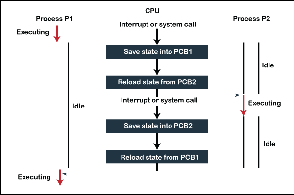

# Process ?

프로그램은 익숙하지만 프로세스는(?)는 익숙한 단어는 아닌 것 같다 둘의 차이점과 프로세스가 무엇인지에 대하여 알아보자

# | _Program_ |

프로세스의 설명에 앞서 프로그램이란 윈도우의 _.exe 혹은 맥의 _.dmg 파일과 같은 컴퓨터에서 실행 할 수 있는 파일을 통칭한다

프로그램은 아직 파일을 실행시키지 않았기 때문에 정적 프로그램(Static Program) 줄여서 프로그램(Program)이라고 한다

어떠판 프로그램을 개발하기 위해서는 자바나 C언어와 같은 언어를 이용해 코드를 작성하여 완성된다

즉 프로그램은 쉽게 말해서 그저 코드 덩어리 인 것

 

# | _Process_ |

프로그램이 그냥 코드 덩어리라면, 프로세스는 프로그램을 실행 시켜 정적인 프로그램이 동적으로 변하여 프로그램이 돌아가는것을 말한다

즉, 컴퓨터에서 작업 중인 프로그램을 의미하는 것이다 모든 프로그램은 운영체제가 실행되기 위한 메모리 공간을 할당해 줘야 실행될 수 있다

그래서 프로그램을 실행하는 순간 파일은 컴퓨터 메모리에 올라가게 되고, 운영체제로부터 시스템 자원(CPU)을 할당받아 프로그램 코드를 실행시켜

우리가 서비스를 이용할 수 있게 되는 것 최종적으로 프로그램과 프로세스를 정리하자면 아래 표와 같다

| 프로그램                                                        | 프로세스                                                            |
| --------------------------------------------------------------- | ------------------------------------------------------------------- |
| 어떤 작업을 하기 위해 실행할 수 있는 파일                       | 실행되어 작업중인 컴퓨터 프로그램                                   |
| 파일이 저장 장치에 있지만 메모리에는 로드 되지 않은 정적인 상태 | 메모리에 로드되고 CPU 자원을 항당받아 프로그램이 실행되고 있는 상태 |
| 코드 덩어리                                                     | 코드 덩어리를 실행한 것                                             |

 

# | _Context Switching_ |

`Context Switching` 에 대해 설명하기 우리는 아래와 같은 작업을 동시에 하고 싶다고 상황을 가정해보자

1.  Youtube Music을 통하여 노래를 듣는다

2.  Visual Studio를 이용하여 코드를 작성한다

3.  메세지 수신을 위하여 카카오톡을 켜놓는다

대부분의 클라이언트들은 해당 과정처럼 하나의 프로세스보단 여러가지의 프로세스를 동시에 사용하기를 원한다

하지만 앞서 설명한것과 같이 프로세스는 CPU를 점유하고 있기 때문에 다른 프로세스는 해당 프로세스가 점유하는 기간 동안은

CPU의 자원을 할당 받을 수 없다 즉 코딩을 하기 위해서 Visual Studio를 키면 Youtube Music이나 카카오톡은 꺼지게 된다

그래서 다수의 프로세스를 동시에 실행하기 위해서 시분할로 짧은 텀을 통해 전환해서 실행을 시키도록 명령한다

 

위의 그림처럼 해당 프로세스를 동시에 실행하기 위한 과정을 설명하자면 이러하다

1. Process1이 실행되며 CPU에 적재함, Process2는 해당 작업이 일어나는 동안 준비 상태로 내려감

2. Process1이 준비상태로 내려감과 동시에 Process2는 CPU에 적재됨

3. Process2가 다시 준비상태로 내려감과 동시에 Process1은 CPU에 적재됨

이 과정을 바로 `Cotext Switching` 이라고 칭하며 해당 프로세스는 동시에 실행되는것 처럼 클라이언트는 받아들이지만

사실상 내부 구조에서는 프로세스의 실행 속도가 굉장히 빠른 속도로 교차하고 있는 것이며 동시에 실행되는 것은 아니다

단 2가지 자원의 의한 Context Switching의 과정만 봐도 굉장히 피로감이 많은 작업임을 알 수 있다

그래서 경량화된 프로세스인 `Thread(스레드)`가 등장하게 된다

 

# | _Thread_ |

그렇다면 `Thread`는 왜 경량화된 Process일까 ? Process는 메모리 구조를 갖는다

- Code : 프로그램을 구성하는 소스코드의 영역

- Data : 전역 변수 static 변수등의 영역

- Stack: 함수의 리턴값 , 매개 변수 등 함수의 호출과 함께 선언되는 영역

- Heap : 런타임 환경에서 동적으로 할당되는 Heap 영역

그림과 같이 하나의 Process안에 다수의 Thread가 있을때 공유되는 자원이 있기 때문이다

여기서 스레드는 Code, Data, Heap 영역을 공통된 자원으로 관리한다, 즉 스레드는 각각의 스택 부분만을 따로 갖고 있는 것이다

공유되는 자원이 존재하기 때문에 컨텍스트 스위칭이 일어나는 경우에 캐싱 히트의 확률이 올라가게 된다

 

# | _Multi-process & Multi-Thread_ |

멀티프로세스와, 멀티스레드 이 두 가지의 개념은 모두 처리방식의 일종이다 여러가지 프로세스의 대한 처리방식이 아닌

한 어플리케이션에 대한 처리방식이라고 생각하면 조금 더 편하게 이해가 될 것 이다

단순히 여러개의 어플리케이션을 열어 놓는 것을 멀티프로세스라고 칭한다면 멀티스레드와의 개념과 비교하여 이해하기 어렵기 때문이다

 

# | _Multi-process_ |

마찬가지로 상황을 예로 들어서 사용자가 로그인을 요청하는 상황이 있다 가정하자 한 프로세스는 매번 하나의 로그인만 처리할 수 있기 때문에

동시에 처리할 수 없다 그래서 부모 프로세스가 fork()하여 자식 프로세스를 생성하여 일을 처리하게 시킨다

이 때 자식 프로세스는 부모와 별개의 메모리 영역을 확보하게 된다, 즉 공유되는 자원은 부모와 자식 프로세스간에는 존재하지 않다

 

# | _Multi-Thread_ |

앞서 설명한 process와는 다르게 한 프로세스 내에서 구분지어진 실행 단위이다 만약 프로세스가 여러가지의 스레드로 구분지어지지 않고

단일 스레드로만 실행된다 (이것이 내가 사용하는 Javascript의 단일 스레드라는 개념이다 ) 이때 실행 단위는 프로세스 그 자체가 된다

조금 더 정확한 설명을 하자면 해당 프로세스의 단일 스레드가 실행 단위가 되는 것 이다

멀티 스레드의 예시로는 우리가 VSCode를 사용하며 코드를 입력하는 동시에 추천 코드를 보여주는것등이 있다

한 애플리케이션의 대한 세분화된 작업을 멀티 스레드가 담당하는 것 이다

 

# | _Difference between Multi-Process And Multi-Thread_ |

| Multi-process                                                  | Multi-Thread                                                  |
| -------------------------------------------------------------- | ------------------------------------------------------------- |
| 각 프로세스는 독립적이다 (서로 공유하는 자원이 존재하지 않다 ) | Thread끼리는 긴밀하게 연결되어 있다(공유하는 자원이 존재한다) |
| IPC를 사용한 통신 방식을 지원한다(Socket, Pipe..)              | 공유된 자원으로 통신 비용 절감                                |
| 자원 소모적, 개별 메모리 차지                                  | 공유된 자원으로 메모리가 효율적임                             |
| Context Switching 비용이 큼                                    | Context Switching 비용이 적음                                 |
| 동기화 작업이 필요하지 않음                                    | 공유 자원 관리를 해야함                                       |

해당 지표만 보면 동기화 작업을 제외한 모든 점에서 멀티스레드의 벨류가 훨씬 높아 보인다 그렇다면 무조건 멀티스레드의 방식이

나의 서비스에 적합할까 그렇지는 않다 Internet Explorer와 Chrome을 예시로 들어보면

한번씩 Internet Explorer의 작동이 중지되었다는 경고문을 받아본적이 있을 것 이다

해당 버튼을 클릭하다보면 모든 Explorer가 종료되며 내가 진행중이던 작업, 페이지등이 전부 닫혀버리는 상황을 맞이한적이 있을 것 이다

이것은 멀티스레드를 이용했기 때문이다 즉 한 스레드에서 이상이 발생하면 공유된 자원을 사용한 모든 스레드에서 전체 프로세스의 영향이 간다

반면 Chrome은 비효율 적인 방면이 존재하지만 멀티프로세서를 이용 하기 때문에 멀티탭 간의 영향을 덜 받게 된다
