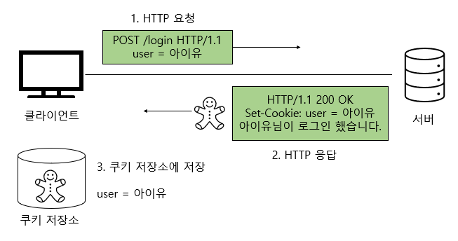
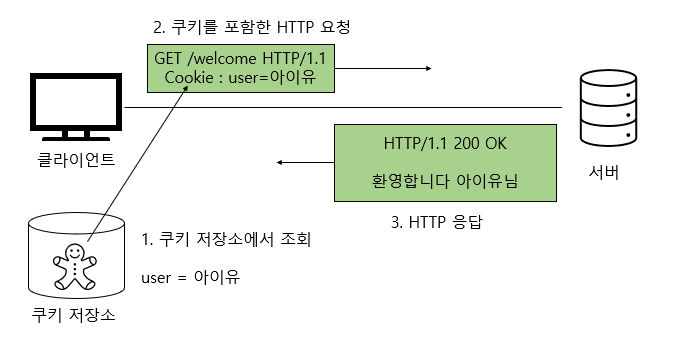

# Cookie, Session

면접 도중에 받았던 질문인 쿠키와, 세션 정확한 답변을 하지 못 한것 같아 정리해보는 포스트

# | _Cookie_ |

쿠키는 클라이언트(로컬)에 저장되는 키와 값이 들어있는 작은 데이터 파일임 이러한 쿠니는 클라이언트에 저장됨

쿠키는 필요시에 정보를 참조하거나 재사용할 수 있음 보통 웹 환경에서는 클라이언트와 서버가 HTTP 프로토콜을 이용해 통신함

하지만 HTTP 프로토콜은 아래와 같은 특징을 갖기 때문에 쿠키를 사용함  
 

# | _HTTP Connectionless_ |

HTTP는 TCP연결을 맺고 요청(Request)을 보내면 서버는 응답(Response)을 보내고 통신을 끊어냄

HTTP 1.1 버전의 `Keep-alive`옵션이 디폴티이긴 하지만 HTTP 1.0 버전은 기본적으로 Connectionless함

- Keep-alive란 ?

  - TCP 통신 이후에 서로의 통신을 끊어내지 않고 서버에서 지속적으로 데이터를 보낼 수 있게 설정함

  - HTTP1.0에도 존재하는 개념이지만 거의 사용되지 않고 1.1부터 디폴트 값으로 설정되어 있음

 

# | _HTTP Statelless(무상태)_ |

HTTP는 상태를 따로 저장하지 않는다. 즉, 연결이 끊어지는 순간 모든 상태 정보가 사라지게 된다

따라서 서버는 클라이언트가 첫 번째 통신 때 보낸 정보는 두번째 통신 때 해당 클라이언트라는 사실을 알 수 없다

이러한 HTTP의 특성 때문에 쿠키가 사용된다

 

# | _Cookie의 특징_ |

1. 이름, 값, 만료일(저장기간), 경로 정보로 구성되어 있다.

2. 클라이언트에 총 300개의 쿠키를 저장할 수 있다.

3. 하나의 도메인 당 20개의 쿠키를 가질 수 있다.

4. 하나의 쿠키는 4KB(=4096byte)까지 저장 가능하다.

 

# | _Cookie의 동작방식_ |

 

1. 클라이언트가 페이지를 요청한다(사용자가 웹사이트에 접근)

2. 웹 서버는 쿠키를 생성한다

3. 생성한 쿠키에 정보를 담아 HTTP 화면을 돌려줄 때, 같이 클라이언트에게 돌려준다

4. 넘겨받은 쿠키는 클라이언트가 가지고 있다(로커 PC에 저장) 다시 서버에 요청할 때 요청과 함께 쿠키를 전송한다

5. 동일 사이트 재방문 시 클라이언트의 PC에 해당 쿠키가 있는 경우, 요청 페이지와 함께 쿠키를 전송한다.

 

# | _Session_ |

세션은 `일정 기간` 동안 같은 클라이언트로 부터 들어오는 일련의 요구를 하나의 상태로 보고 그 상태를 일정하게 유지시키는 기술이다

여기의 일정 기간은 방문자가 웹 브라우저를 통해 웹 서버에 접속한 시점부터 웹 브라우저를 종료하며 연결을 끝내는 시점을 말한다.

즉, **방문자가 웹 서버에 접속해 있는 상태를 하나의 단위로 보고 그것을 세션이라고 한다**

 

# | _Session 특성_ |

1. 웹 서버에 웹 컨테이너의 상태를 유지하기 위한 정보를 저장한다.

2. 웹 서버의 저장되는 쿠키(=세션 쿠키)

3. 브라우저를 닫거나, 서버에서 세션을 삭제했을 때만 삭제가 되므로, 쿠키보다 비교적 보안이 좋다.

4. 저장 데이터에 제한이 없다. (서버 용량이 허용하는 한에서)

5. 각 클라이언트에 고유 Session ID를 부여한다. Session ID로 클라이언트를 구분해 각 요구에 맞는 서비스를 제공

 

# | _Sessiond의 동작원리_ |

1. 클라이언트가 서버에 접속 시 세션 ID를 발급 받음

2. 클라이언트는 세션 ID에 대해 쿠키를 사용해서 저장하고 가지고 있음

3. 클라리언트는 서버에 요청할 때, 이 쿠키의 세션 ID를 같이 서버에 전달해서 요청

4. 서버는 세션 ID를 전달 받아서 별다른 작업없이 세션 ID로 세션에 있는 클라언트 정보를 가져와서 사용

5. 클라이언트 정보를 가지고 서버 요청을 처리하여 클라이언트에게 응답

 

# | _Difference between Cookie and Session_ |

- 쿠키와 세션은 비슷한 역할을 하며, 동작 원리도 비슷하다 그 이유는 세션도 결국 쿠키를 사용하기 때문임

- 큰 차이점은  사용자의 정보가 저장되는 위치이다   쿠키는 서버의 자원을 전혀 사용하지 않으며  , 세션은 서버의 자원을 사용한다

- 보안 면에선 세션이 더 우수하다

- 쿠키는 클라이언트 로컬에 저장되기 때문에 변질되거나, request에서 스니핑 당할 우려가 있기 때문에 보안에 취약하다

- 세션은 쿠키를 이용해 session-id만을 제공하고 그것으로 구분해 서버에서 처리하기 때문에 비교적 보안성이 높다

- 라이프 사이클은 쿠키도 만료기간이 있지만 파일로 저장되기 때문에 브라우저를 종료해도 정보가 유지될 수 있다 
  또한 만료기간을 따로 지정해 쿠키를 삭제할 때까지 유지할 수도 있다

- 반면에 세션도 만료기간을 정할 수 있지만, 브라우저가 종료되면 만료기간과 상관없이 삭제된다

- 속도 면에서는 쿠키가 더 우수하다

- 쿠키는 쿠케에 정보가 있기 때문에 서버에 요청 시 속도가 빠르고

- 세션은 정보가 서버에 있기 때문에 처리가 요구되어 비교적 느린 속도를 낸다

| 제목                  | 쿠키(Cookie)                                                                   | 세션(Session)                        |
| --------------------- | ------------------------------------------------------------------------------ | ------------------------------------ |
| 저장 위치             | 클라이언트(접속자PC)                                                           | 웹 서버                              |
| 저장 형식             | text                                                                           | Object                               |
| 만료 시점             | 쿠키 저장시 설정 (브라우저가 종료되도, 만료시점이 지나지 않으면 삭제되지 않음) | 브라우저 종료시 삭제(기간 지정 가능) |
| 사용하는 자원(리소스) | 클라이언트 리소스                                                              | 웹 서버 리소스                       |
| 용량 제한             | 총 300개, 하나의 도메인 당 20개                                                | 서버가 허용하는 한 용량제한 없음     |
| 속도                  | 세션보다 빠름                                                                  | 쿠키보다 느림                        |
| 보안 제한             | 세션보다 안 좋음                                                               | 쿠키보다 좋음                        |
