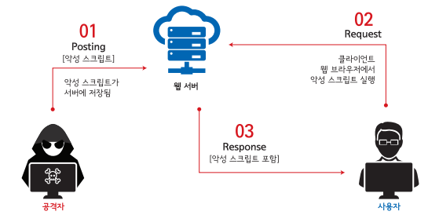

# XSS(Cross Site Scripting)

XSS(Cross Site Scripting) 공격은 무엇인가에 대한 질문을 면접에서 마주치게 됐는데

사실 무엇인지 조차 몰라서 대답을 드릴수는 없었다 그러면 해당 공격이 무엇이고

어떠한 대처 방법이 존재하는지 알아보자

 

# What is XSS attack ?

XSS(Cross Site Scripting)이란 특정 웹 사이트에 임의의 스크립트를 삽입해서 공격하는 방법이다

주로 사용자의 입력 데이터를 검증하지 않을 때 발생하게 된다

주로 사이트의 게시판과 관련된 보안 취약점이며 사이트의 사용자를 주 공격 대상으로 삼으며

스크립트 주 목적은 유저 정보의 탈취이다

(~~XSS 하니까 생각나는데 우영우 드라마에서 나온 공격 방법도 XSS 아닌가..?~~)

 

# How XSS Attacks ?

## XSS Attack Sequence

1. 해커가 사전에 만든 웹페이지에 사용자의 브라우저로 엑세스를 시도

2. XSS공격 link가 포함된 웹페이지가 브라우저가 실행됨

3. 사용자가 해당 link를 클릭

4. 사용자의 느끼지 못하는 사이 취약한 사이트에 있는 해커의 스크립트가 엑세스 됨

5. 사용자의 웹브라우저 상에서 해커의 스크립트가 실행이 됨

## Type of XSS

XSS는 크게 `Reflected-XSS`, `Stored-XSS` 두 종류로 나뉘어짐

사용자의 브라우저가 악성 스크립트를 실행하게 하는 목적은 같지만 그 방식에 따라 나뉘어짐

- **Reflected XSS**

  - URL의 변수 부분처럼 스크립트 코드를 입력하는 동시에 결과가 바로 전해지는 공격기법

  - 반사된 XSS는 피싱 공격의 일부로 자주 사용되며 악용하기도, 차단하기도 가장 쉬움

  - 공격자가 HTTP 요청에 악성 콘텐츠를 주입하면 그 결과가 사용자에게 **반사되는** 형태

  - 반사된 XSS는 피싱 공격에서 가장 많이 사용됨

- **Stored XSS**

  - 가장 일반적인 XSS 공격 유형

  - 정상적 평문이 아닌 스크립트 코드를 입력해서 사용함

  - 사용자가 게시물을 열람시, 공격자가 입력해놓은 악성 스크립트가 실행되어  
    사용자의 쿠키 정보를 유출, 악성 스크립트가 기획한 공격이 실행됨

  - 악성코드를 저장하도록 하는 수법, 서버에 저장된 악성코드는 시스템 자체를 공격 할 수 있으며 
    웹 앱 사용자 상당수 또는 전체에 악성 코드를 전송할 수 있음

  - 일반적인 예로는 블로그 댓글에 악성코드를 게시, 메일로 특정 url 전송

  - 지속적(저장형) 공격으로 가장 위험한 XSS 공격

 

# How Can Shield to XSS Attack

## 1. 입력 값 검증

데이터가 입력되기 전이나, 입력된 데이터를 서버로 전달하기 전에 프론트에서 검증

- 입력 데이터의 길이 제한하기

- 지정된 문자 또는 형식이 벗어나는지 확인

- 정해진 규칙을 벗어난 입력 값들은 무효화

## 2. 출력 값 검증

가장 많이 사용 되는 대응 방식, 가장 유명한 예시로는 게시판 상세 페이지가 존재함

게시판에 올라온 글을 클릭하면, 해당 글의 상세 내용을 조회하는 api를 호출하게 되는데

이 때, 상세 내용에 HTML 또는 스크립트 구문이 들어가 있다면, 스크립트로 해석될 수 있다

그래서 스크립트로 해석될 여지가 있는 특수 문자들을 인코딩해서 보여줘야 한다

| 변경 전 | 변경 후 | 변경 전 | 변경 후 |
| ------- | ------- | ------- | ------- |
| &       | &amp    | "       | &quot   |
| <       | &lt     | '       | &#x27   |
| (       | &#40    | )       | &#41    |

## 3. 보안 라이브러리 사용

개발자가 직접 입/출력 데이터를 검증하는 방법도 한계는 분명히 존재한다

이럴 때 보안을 위한 라이브러리를 사용하면 좀 더 안정적인 서비스를 운영할 수 있는데

사람이 만든 보안 시스템의 100% 안정은 존재 할 수 없다 그저 뛰어난 개발자의 솔루션을 믿는 방법 밖에는

요즘은 네이버의 개발한 `Lucy-Xss-Servlet-Filter` 라이브러리 등을 많이 사용한다고 한다
