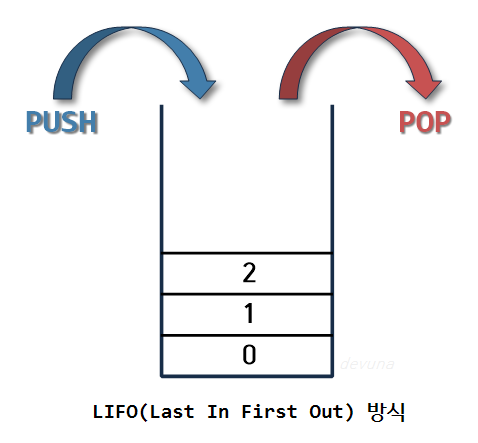

# | _Stack Queue (스택, 큐)_ |

스택과 큐는 프로그래밍이라는 개념이 탄생할 때부터 사용된 가장 고전적인 자료구조이다

그럼 스택과 큐는 어떻게 다르며 프로그래밍에서 어떻게 사용될까 그것에 대하여 알아보자

# | _Stack, Queue 자료구조_ |

- Stack

  - LIFO(Last In First Out) 후입 선출의 자료구조를 갖고 있다

- Queue

  - FIFO(Fist In First Out) 선입 선출의 자료구조를 갖고 있다

# | _Stack_ |

스택(stack)이란 영문 뜻 그대로 **쌓아 올린다는 것** 을 의미한다

따라서 스택 자료구조라는 것은 책을 쌓는 것처럼 쌓아 올린 형태의 자료구조를 말한다

스택은 위의 사진처럼 같은 구조와 크기의 자료를 정해진 방향으로만 쌓을수 있고, top으로 정한 곳을 통해서만 접근할 수 있다

top의 자료는 가자 최근에 들어온 자료를 가리키고 있으며, 삽입되는 새 자료는 top이 가리키는 자료의 위에 쌓이게 된다

스택에서 자료를 삭제할 때도 top을 통해서만 가능하다 즉 스택은 삽입 연산으로 push 삭제 연산으로 pop을 사용한다

따라서 스택은 시간 순서에 따라 자료가 쌓여서 가장 마지막에 삽입된 자료가 가장 먼저 삭제된다는 LIFO 알고리즘이 이용된다

추가로 비어있는 스택에서 원소를 추출하려고 할 때 stack underflow라고 하며, 스택이 넘치는 경우 stack overflow라고 한다

 

# |_Queue_|

> queue[발음: 큐]의 뜻은 명사로는 '줄', 동사로는 '줄을 서다' 라는 뜻

Queue의 사전적 의미는 위와 같다 따라서 일상생활에서 놀이동산에서 줄을 서서 기다리는 것,

은행에서 먼저 온 사람의 업무를 창구에서 처리하는 것과 같이 선입선출(FIFO, Firest In First Out)의 자료구조를 말한다

정해진 한 곳(top)을 통해서 삽입, 삭제가 이루어지는 스택과는 달리 큐는 한쪽 끝에서 삽입 작업이, 다른 끝에서 삭제 작업이 양쪽으로 이루어진다

이때 삭제연산만 수행되는 곳을 프론트(front), 삽입연산만 이루어지는 곳을 리어(rear)로 정하여 각각의 연산작업만 수행된다

이때 큐의 리어에서 이루어지는 삽입연산을 인큐(enQueue) 프론트에서 이루어지는 삭제연산을 디큐(dnQueue)라고 부른다

즉, 큐에서는 프론트 원소는 가장 먼저 큐에 들어왔던 첫 번째 원소가 되는 것이며, 리어 원소는 가장 늦게 큐에 들어온 마지막 원소가 되는 것이다
