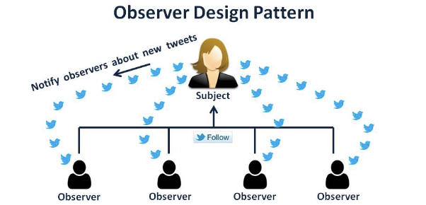

# CS 면접대비

책을 보면서 배우는 CS내용에 대해서 정리해보자

> 💡 옵저버 패턴 ? <br>
> 옵저버 패턴이이란 주채가 어떤 객체의 상태 변화를 관찰하다가 <br>
> 상태 변호가 있을 때마다 메서드 등을 통해 옵저버 목록에 있는 옵저버들에게 변화를 알려주는 패턴
>
> 대표적으로 `Twitter` 서비스를 예를 들수 있다



해당 그림처럼 내가 어떤 사람인 주체를 '팔로우' 했다면 주체가 포스팅을 올리게 되면<br>
알림이 '팔로워'에게 가야함 (subscription이 아닌지 ?)

## 1. Javascript observver pattern

자바스크립트에서의 옵저버 패턴은 `프록시` 객체를 통해 구현할 수도 있다

```
* 프록시 *

프록시(proxy) 객체는 어떠한 대상의 기본적인 동작(속성 접근, 할당, 순회, 열거, 함수 호출 등)의 작업을 가로챌 수 있는 객체를 뜻하며,
자바스크립트에서 프록시 객체는 두개의 매개변수를 가진다

* target : 프록시할 대상
* handler : 프록시 객체의 target 동작을 가초래서 정의할 동작이 정해져 있는 함수
```

```javascript
// 예제 1
const handler = {
  get: function (target, name) {
    return name === "name" ? `${target.a} ${target.b}` : target[name];
  },
};

const p = new Proxy({ a: "KUNDOL", b: "IS AUMUMU ZANGIN" }, handler);
console.log(p.name); // KUNDOL IS AUMUMU ZANGIN
```

new Proxy로 선언한 객체와 a와 b라는 속성에 특정 문자열을 담아서 handler에 <br>
"name이라는 속성에 접근할 때는 a와 b라는 것을 합쳐서 문자열을 만들어라."를 구현함<br>
이렇게 p라는 변수에 name이라는 속성을 선언하지 않았는데도<br>
p.name으로 name이라는 속성에 접근하려고 할 때, 그 부분을 가로채 문자열을 만들어 반환하는 것을 볼 수 있다

```javascript
// 예제 2
function createReactiveObject(target, callback) {
  const proxy = new Proxy(target, {
    set(obj, prop, value) {
      if (value !== obj[prop]) {
        const prev = obj[prop];
        obj[prop] = value;
        callback(`${prop}가 [${prev}] >> [${value}] 로 변경되었습니다`);
      }
      return true;
    },
  });
  return proxy;
}
const a = {
  형규: "솔로",
};
const b = createReactiveObject(a, console.log);
b.형규 = "솔로";
b.형규 = "커플";
// 형규가 [솔로] >> [커플] 로 변경되었습니다
```
